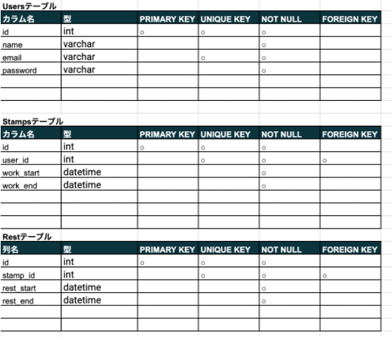

# Atte(アット)
ある企業の勤怠管理アプリケーション
会員登録後、勤務／休憩の開始、終了を登録し勤務状況を管理することができる。

## 作成した目的
人事評価のため

## アプリケーションのU R L
http://localhost:8080/

## 他のリポジトリ
https://github.com/hamakei0089/demo-case.git

## 機能一覧
会員登録
ログイン機能
勤務開始、終了登録機能
休憩開始、終了機能
日別勤怠管理

## 使用技術（実行環境）
PHP 8.3.0
Laravel Framework 8.83.27
MySQL8.0.26

## テーブル設計

## ER図

# 環境構築

Dockerビルド
1. git clone git@github.com:hamakei0089/mock-case.git
2. DckerDesktopを立ち上げる
3.docker-compose up -d –build

Laravel環境構築
1.docker-compose exec php bash
2.composer install
3.「.env.example」ファイルを「.env」ファイルに命名を変更
4. .envに以下の環境変数を追加

DB_CONNECTION=mysql
DB_HOST=mysql
DB_PORT=3306
DB_DATABASE=laravel_db
DB_USERNAME=laravel_user
DB_PASSWORD=laravel_pass

5. アプリケーションキーの作成
php artisan key:generate

6. マイグレーションの実行
php artisan migrate
# demo-case
